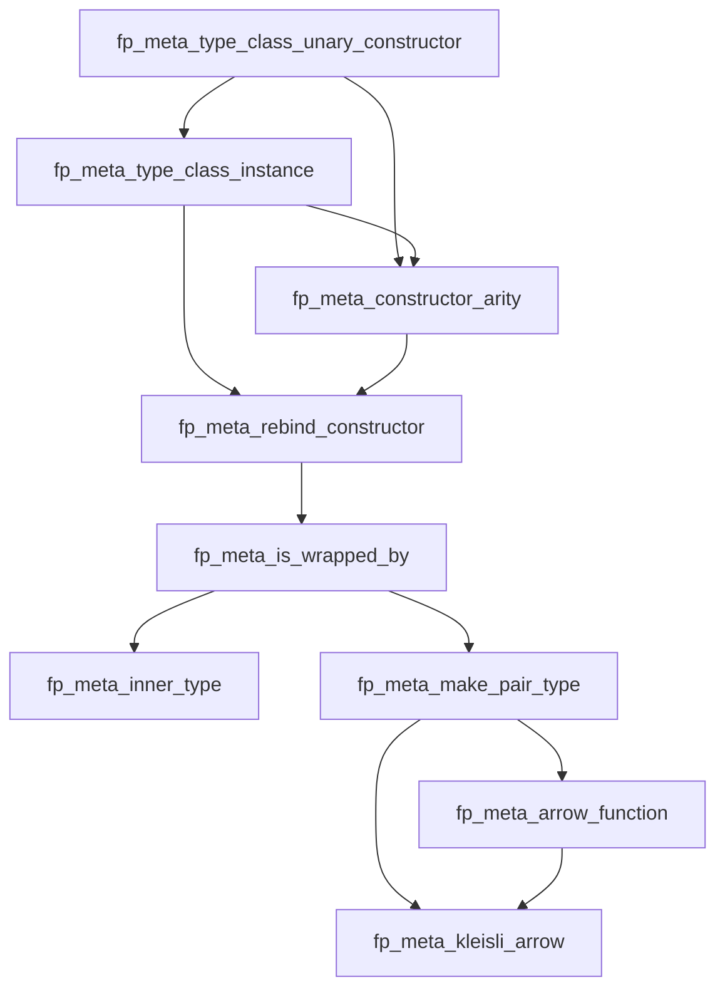

FP++ Type Tools
---

### Table of Contents

* [Namespaces](#namespaces)
  * [type_class_unary_constructor](#fpmetatype_class_unary_constructor)
  * [type_class_instance](#fpmetatype_class_instance)
  * [constructor_arity](#fpmetaconstructor_arity)
  * [rebind_constructor](#fpmetarebind_constructor)
  * [wrapped_by](#fpmetawrapped_by)
  * [inner_type](#fpmetainner_type)
  * [make_pair_type](#fpmetamake_pair_type)
  * [arrow_function](#fpmetaarrow_function)
  * [kleisli_arrow](#fpmetakleisli_arrow)
* [Dependencies](#dependencies)

### Namespaces

#### fp::meta::type_class_unary_constructor

| **Name**                  | **Type**  | **Brief**                                                        |
|---------------------------|-----------|------------------------------------------------------------------|
| `fp_is_unary_constructor` | `bool`    | Checks if a type constructor takes exactly one type argument.    |
| `fp_unary_constructor`    | `concept` | Concept to ensure a type constructor takes exactly one argument. |

#### fp::meta::type_class_instance

| **Name**                    | **Type**  | **Brief**                                                               |
|-----------------------------|-----------|-------------------------------------------------------------------------|
| `fp_is_type_class_instance` | `bool`    | Checks whether a type is an instance of a unary type constructor.       |
| `fp_type_class_instance`    | `concept` | Concept to verify if a type is an instance of a unary type constructor. |

#### fp::meta::constructor_arity

| **Name**                   | **Type**      | **Brief**                                                             |
|----------------------------|---------------|-----------------------------------------------------------------------|
| `fp_get_constructor_arity` | `std::size_t` | Retrieves the arity (number of type arguments) of a type constructor. |

#### fp::meta::rebind_constructor

| **Name**                | **Type** | **Brief**                                                                     |
|-------------------------|----------|-------------------------------------------------------------------------------|
| `fp_rebind_constructor` | `alias`  | Rebinds a type constructor instance to a new type while preserving structure. |

#### fp::meta::wrapped_by

| **Name**                | **Type**  | **Brief**                                                                              |
|-------------------------|-----------|----------------------------------------------------------------------------------------|
| `fp_is_wrapped_by_with` | `bool`    | Verifies if a type is wrapped by a given type constructor.                             |
| `fp_wrapped_by_with`    | `concept` | Concept to check if a type is wrapped by another type constructor in a specific order. |
| `fp_is_wrapped_by`      | `bool`    | Checks if a type is wrapped by one type constructor.                                   |
| `fp_wrapped_by`         | `concept` | Concept to check if a type is wrapped by one type constructor.                         |
| `fp_is_wrapped_as`      | `concept` | Ensures a type is wrapped as `Outer<Inner<T>>`.                                        |

#### fp::meta::inner_type

| **Name**                 | **Type**  | **Brief**                                                |
|--------------------------|-----------|----------------------------------------------------------|
| `fp_inner_type`          | `alias`   | Extracts the inner type from a wrapped type constructor. |
| `fp_has_inner_type`      | `concept` | Ensures a type class instance has an inner type.         |
| `fp_has_same_inner_type` | `concept` | Ensures two types have the same inner type.              |

#### fp::meta::make_pair_type

| **Name**            | **Type** | **Brief**                                                      |
|---------------------|----------|----------------------------------------------------------------|
| `fp_make_pair_type` | `alias`  | Converts a type of the form `TC<A, B>` into `std::pair<A, B>`. |

#### fp::meta::arrow_function

| **Name**                              | **Type**  | **Brief**                                                                           |
|---------------------------------------|-----------|-------------------------------------------------------------------------------------|
| `fp_is_arrow_function`                | `bool`    | Checks if a function is a unary function (takes one argument and returns a result). |
| `fp_arrow_function`                   | `concept` | Concept for unary functions.                                                        |
| `fp_get_arrow_function_argument_type` | `alias`   | Retrieves the argument type of a unary function.                                    |
| `fp_get_arrow_function_return_type`   | `alias`   | Retrieves the return type of a unary function.                                      |

#### fp::meta::kleisli_arrow

| **Name**                          | **Type**  | **Brief**                                                                               |
|-----------------------------------|-----------|-----------------------------------------------------------------------------------------|
| `fp_is_kleisli_arrow`             | `bool`    | Checks if a function is a Kleisli arrow (returns a type wrapped by a type constructor). |
| `fp_kleisli_arrow`                | `concept` | Concept for checking if a function is a Kleisli arrow.                                  |
| `fp_get_kleisli_result_type`      | `alias`   | Retrieves the inner type of the result type returned by a Kleisli arrow function.       |
| `fp_get_kleisli_type_constructor` | `alias`   | Rebinds a Kleisli arrow's result type to a new type constructor.                        |

### Dependencies

