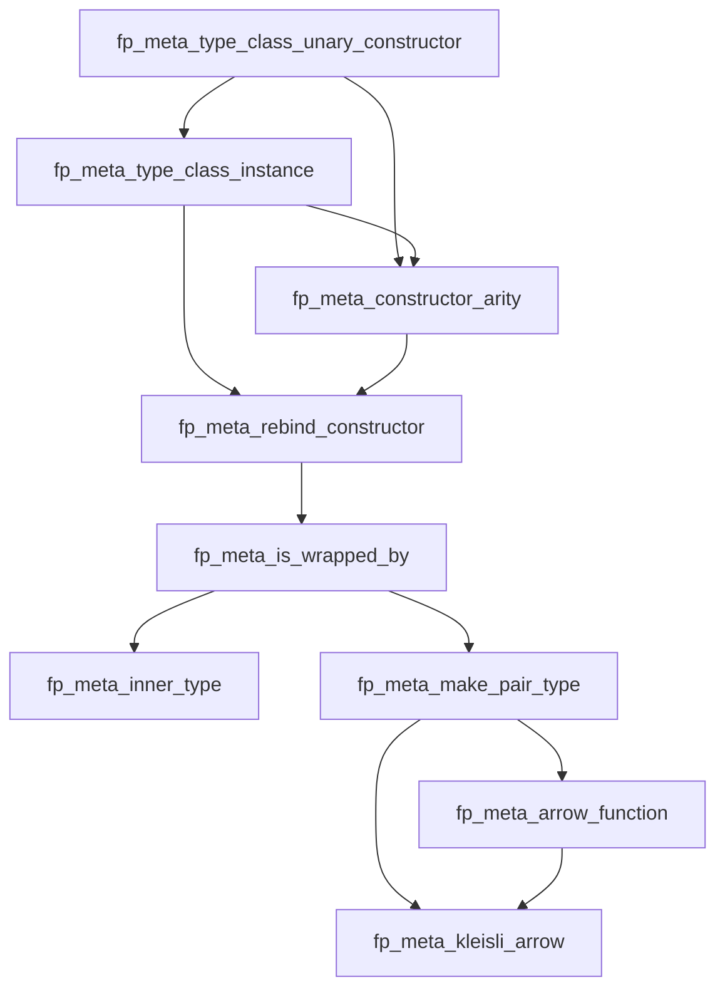

FP++ Type Tools
---

### Table of Contents

1. [Namespaces](#namespaces)
    1. [fp::meta::type_class_unary_constructor](#fpmeta-type-class-unary-constructor)
    2. [fp::meta::type_class_instance](#fpmeta-type-class-instance)
    3. [fp::meta::constructor_arity](#fpmeta-constructor-arity)
    4. [fp::meta::rebind_constructor](#fpmeta-rebind-constructor)
    5. [fp::meta::is_wrapped_by](#fpmeta-is-wrapped-by)
    6. [fp::meta::inner_type](#fpmeta-inner-type)
    7. [fp::meta::make_pair_type](#fpmeta-make-pair-type)
    8. [fp::meta::arrow_function](#fpmeta-arrow-function)
    9. [fp::meta::kleisli_arrow](#fpmeta-kleisli-arrow)
2. [Dependencies](#dependencies)

### Namespaces

#### fp::meta::type_class_unary_constructor

| **fp_...**                | **type (alias, concept, etc)** | **brief**                                                        |
|---------------------------|--------------------------------|------------------------------------------------------------------|
| `fp_is_unary_constructor` | `inline constexpr bool`        | Checks if a type constructor takes exactly one type argument.    |
| `fp_unary_constructor`    | `concept`                      | Concept to ensure a type constructor takes exactly one argument. |

#### fp::meta::type_class_instance

| **fp_...**                  | **type (alias, concept, etc)** | **brief**                                                               |
|-----------------------------|--------------------------------|-------------------------------------------------------------------------|
| `fp_is_type_class_instance` | `inline constexpr bool`        | Checks whether a type is an instance of a unary type constructor.       |
| `fp_type_class_instance`    | `concept`                      | Concept to verify if a type is an instance of a unary type constructor. |

#### fp::meta::constructor_arity

| **fp_...**                 | **type (alias, concept, etc)** | **brief**                                                             |
|----------------------------|--------------------------------|-----------------------------------------------------------------------|
| `fp_get_constructor_arity` | `inline constexpr std::size_t` | Retrieves the arity (number of type arguments) of a type constructor. |

#### fp::meta::rebind_constructor

| **fp_...**              | **type (alias, concept, etc)** | **brief**                                                                     |
|-------------------------|--------------------------------|-------------------------------------------------------------------------------|
| `fp_rebind_constructor` | `alias`                        | Rebinds a type constructor instance to a new type while preserving structure. |

#### fp::meta::is_wrapped_by

| **fp_...**              | **type (alias, concept, etc)** | **brief**                                                                              |
|-------------------------|--------------------------------|----------------------------------------------------------------------------------------|
| `fp_is_wrapped_by_with` | `inline constexpr bool`               | Verifies if a type is wrapped by a given type constructor.                             |
| `fp_wrapped_by_with`    | `concept`                      | Concept to check if a type is wrapped by another type constructor in a specific order. |
| `fp_is_wrapped_by`      | `inline constexpr bool`               | Checks if a type is wrapped by one type constructor.                                   |
| `fp_wrapped_by`         | `concept`                      | Concept to check if a type is wrapped by one type constructor.                         |
| `fp_is_wrapped_as`      | `concept`                      | Ensures a type is wrapped as `Outer<Inner<T>>`.                                        |

#### fp::meta::inner_type

| **fp_...**               | **type (alias, concept, etc)** | **brief**                                                |
|--------------------------|--------------------------------|----------------------------------------------------------|
| `fp_inner_type`          | `alias`                        | Extracts the inner type from a wrapped type constructor. |
| `fp_has_inner_type`      | `concept`                      | Ensures a type class instance has an inner type.         |
| `fp_has_same_inner_type` | `concept`                      | Ensures two types have the same inner type.              |

#### fp::meta::make_pair_type

| **fp_...**          | **type (alias, concept, etc)** | **brief**                                                      |
|---------------------|--------------------------------|----------------------------------------------------------------|
| `fp_make_pair_type` | `alias`                        | Converts a type of the form `TC<A, B>` into `std::pair<A, B>`. |

#### fp::meta::arrow_function

| **fp_...**                            | **type (alias, concept, etc)** | **brief**                                                                           |
|---------------------------------------|--------------------------------|-------------------------------------------------------------------------------------|
| `fp_is_arrow_function`                | `inline constexpr bool`        | Checks if a function is a unary function (takes one argument and returns a result). |
| `fp_arrow_function`                   | `concept`                      | Concept for unary functions.                                                        |
| `fp_get_arrow_function_argument_type` | `alias`                        | Retrieves the argument type of a unary function.                                    |
| `fp_get_arrow_function_return_type`   | `alias`                        | Retrieves the return type of a unary function.                                      |

#### fp::meta::kleisli_arrow

| **fp_...**                        | **type (alias, concept, etc)** | **brief**                                                                               |
|-----------------------------------|--------------------------------|-----------------------------------------------------------------------------------------|
| `fp_is_kleisli_arrow`             | `inline constexpr bool`        | Checks if a function is a Kleisli arrow (returns a type wrapped by a type constructor). |
| `fp_kleisli_arrow`                | `concept`                      | Concept for checking if a function is a Kleisli arrow.                                  |
| `fp_get_kleisli_result_type`      | `alias`                        | Retrieves the inner type of the result type returned by a Kleisli arrow function.       |
| `fp_get_kleisli_type_constructor` | `alias`                        | Rebinds a Kleisli arrow's result type to a new type constructor.                        |

### Dependencies

