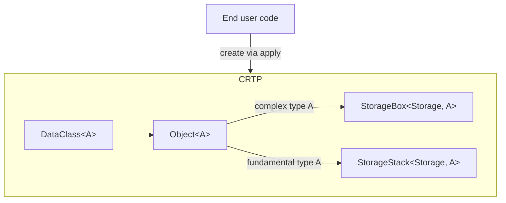

### Storage Abstraction

### Specs

DataClass:

* Must be an unary type-class instance
* Hold its value using Object
* Cannot be created other than through `apply`, which maybe called by `pure`
* Cannot be:
    * moved
    * **not** copied, only recreated via `apply`
* `apply<A>` returns `DataClass<A>` with `A` decayed.
