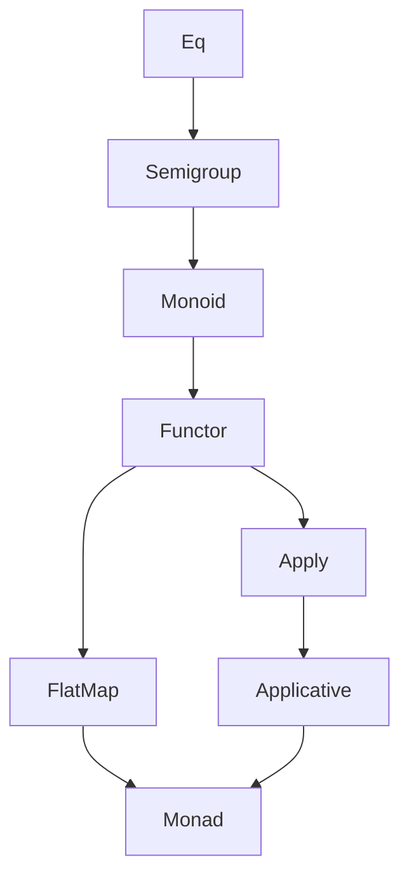

# Plan: Building a Typeclass Hierarchy (Towards Monad)

This document outlines the next steps in building a typeclass-based functional programming library in C++. The current state includes `Eq`, `Functor`, and `FlatMap`, and the goal is to continue towards a fully-featured `Monad`. The immediate focus is to implement `Semigroup` and `Monoid`.

---

## Typeclass Progression

```
Eq → Semigroup → Monoid → Functor → Apply → Applicative → FlatMap → Monad
```

### Immediate Next Steps

#### DONE 1. Semigroup

- Define an interface:
  ```cpp
  template <typename A>
  struct Semigroup {
    static auto combine(const A&, const A&) -> A;
  };
  ```

- Implement instances for common types:
  - `int`, `std::string`, custom wrappers
- Location:
  - `include/fp/traits/semigroup.h`
  - `include/fp/operators/semigroup.h` (e.g., overloaded `<>`, if safe)

#### DONE 2. Monoid

- Define interface extending `Semigroup`:
  ```cpp
  template <typename A>
  struct Monoid : Semigroup<A> {
    static auto empty() -> A;
  };
  ```

- Implement instances:
  - `int`: Sum and Product Monoids
  - `std::string`: empty = ""

- Location:
  - `include/fp/traits/monoid.h`
  - `include/fp/operators/monoid.h`

### Utilities

- Provide utilities like:
  ```cpp
  template <typename A, typename Container>
  A combineAll(const Container& xs);
  ```

### Testing

- Add unit tests in `test/src/traits/`:
  - `semigroup.cpp`
  - `monoid.cpp`
- Use property/law-based checks:
  - `combine(x, empty) == x`
  - `combine(combine(x, y), z) == combine(x, combine(y, z))`

### Optional Enhancements

- Add support for multiple monoids per type using tag wrappers or newtypes.
- Auto-derive Monoid if a type is default-constructible and has a Semigroup.

---

## Overall Hierarchy Plan



You can track both branches (`FlatMap` → `Monad` and `Apply` → `Applicative`) in parallel.

---

## File Layout Summary

- `traits/semigroup.h` and `monoid.h`
- `operators/semigroup.h` and `monoid.h`
- `test/src/traits/semigroup.cpp`
- `test/src/traits/monoid.cpp`

---

Would you like help scaffolding any of these headers or tests?
