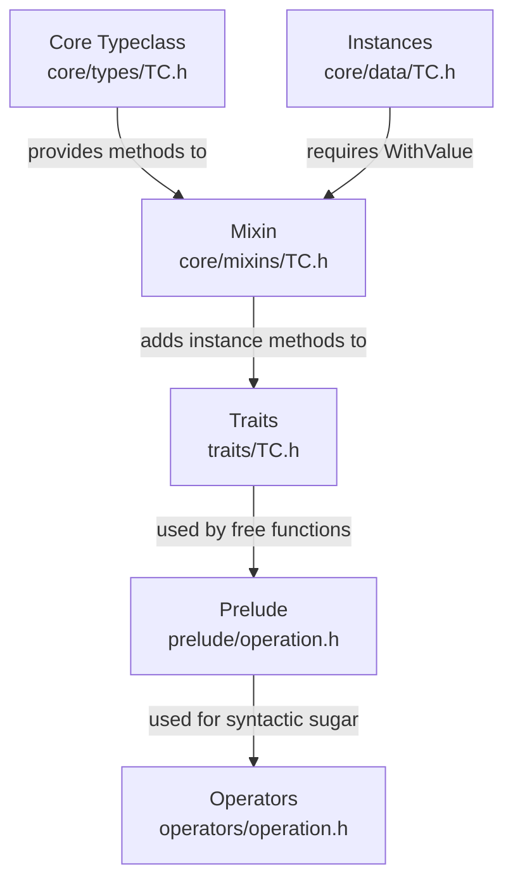
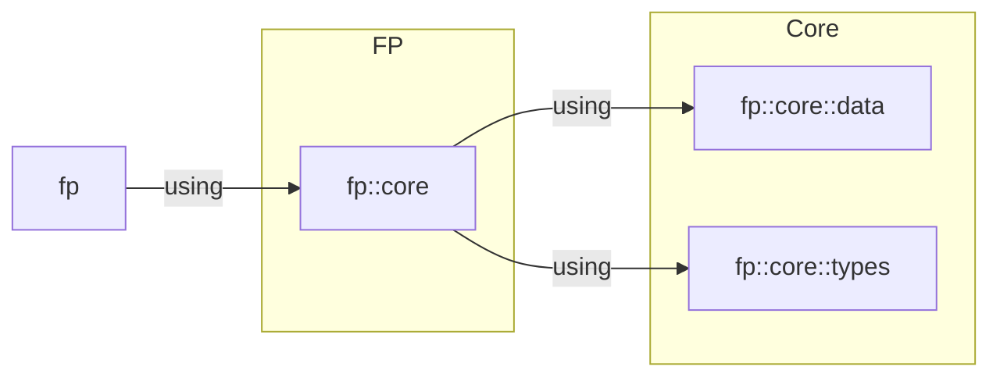

## FP++: C++20 Functional Programming Header-Only Library

## Table of Contents

## Usage

- You only need the `fp` directory from the `include` directory. Just copy it
  into your project and add to include path.
- There are no dependencies; it just works.
- For examples of usage, take a look at the `*.cpp` files in the `test`
  directory.
- Use it responsibly and at your own discretion.

## Code Organization

In FP++, typeclasses are organized to separate core definitions, mixins,
traits,and syntactic sugar.

### Type Naming Conventions

- `T` denotes a raw C++ type, such as `const int&` or `double*`.
- `A` represents a normalized FP type, which is typically a wrapped or adapted
  version of a raw type.
- `F` stands for type constructors, which are templates or higher-kinded types
  that produce types when applied.
- `Fn` usually indicates a unary arrow (function).

The following table summarizes the components involved in defining and using a  
typeclass `TC` for a datatype `F` and an `operation` on `F[A]`.

| Component      | Location                  | Description                                                                           |
|----------------|---------------------------|---------------------------------------------------------------------------------------|
| Core Typeclass | `core/types/TC.h`         | Provides `TC<F>::method`                                                              |
| Instances      | `core/data/TC.h`          | Provides `TC` instances, e.g., `Id`, `Option`, etc.                                   |
| Mixins         | `core/mixins/operation.h` | Given `TC<F>`, provides `F<A>.operation` as an instance method                        |
| Traits         | `traits/TC.h`             | Defines concepts `HasTC` (constructible `TC<F>`) and `IsTC` (`F<A>` has `.operation`) |
| Prelude        | `prelude/operation.h`     | Defines a free function `operation` on `F[_]`                                         |
| Operators      | `operators/operation.h`   | Provides syntactic sugar for the `operation` free function                            |



#### Special `WithValue`, `WithApply`, and `pure` Case

Mixins `WithValue` and `WithApply`, along with the free function `pure`, are
special in that they are not tied to a specific typeclass; instead, they must be
implemented by any datatype to enable storage and manipulation of values.

| Item        | Provides                                               |
|-------------|--------------------------------------------------------|
| `WithValue` | Instance method `.value()` to extract the stored value |
| `WithApply` | Static internal method `::apply(fab)` used by `pure`   |
| `pure`      | Free function `pure<F>(a)` to wrap a value             |

### Development Checklist

For typeclass TC and TC::operation

- core/types/tc.h → define `TC<F>` with static `operation`
- core/mixins/operation.h → add instance method `.equals` via mixin
  `WithOperation` which uses `TC::operation`
- traits/tc.h → define `HasTC` and `IsTC` concepts
- prelude/operation.h → free function `operation`
- operators/operation.h → `operator` for `operation`, if it makes sense
- tests/core/types/tc.cpp → test mixin and laws
- tests/prelude/operation.cpp → test free `operation` and operators

#### Done so far

| TC      | Mixin   | Trait                 | Operation | Test Core | Test Prelude |
|---------|---------|-----------------------|-----------|-----------|--------------|
| Eq      | WithEq  | HasEq, IsEq           | equals    | Yes       | Yes          |
| Functor | WithMap | HasFunctor, IsFunctor | fmap      |           |              |

### Namespacing



### Testing

The directory structure under `tests/` mirrors that of `core/`,  
`traits/`, `prelude/`, and  
`operators/` under `include/fp`.

| Directory                     | Tests                          |
|-------------------------------|--------------------------------|
| `tests/core/types/TC.cpp`     | Mixins, typeclass laws, traits |
| `tests/prelude/operation.cpp` | Free functions and operators   |

## Installation

1. Clone this repository.
2. Copy the `fp` directory from `include` into your include path.
3. Include the library with `#include <fp/fp.h>`.
4. Compile with a C++20-compliant compiler.

```bash
g++ -Iinclude -o fp_test main.cpp -std=c++20 -g -O0
```

## Documentation

Documentation is _incomplete_. Most of the readme files are totally bogus.

## Building and Testing

```bash
cmake -B build -S .
cmake --build build
ctest --test-dir build
```

## License

This project is licensed under the MIT License - see the [LICENSE](LICENSE) file
for details.
