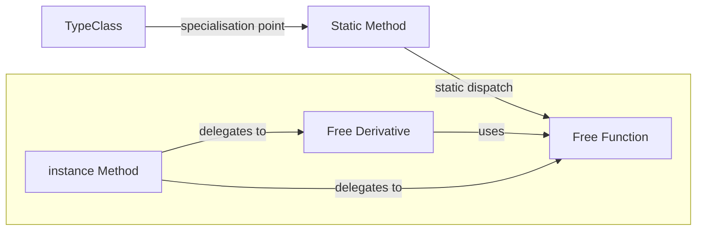

`FP++`: C++20 Functional Library
---
FP the hell out of C++

---

`FP++` is header-only library: all it needs to do is done at compile time and
doesn't involve runtime type resolution, function calls or, God forbid, vtable
lookups.

`FP++` allows you to use existing or build your own typeclasses as lego pieces
like there is no tomorrow. Think of Scala Cats but in C++.

### TL;DR

Have a look at:

- `test/src/syntax/operators.cpp` — `|`, `*`, `&=` operators in action
- `test/src/kernel/ops/compose.cpp` — right-to-left function composition
- `test/src/kernel/ops/pipe.cpp` — left-to-right function pipelines
- `test/src/core/functor.cpp` — lifting morphisms into type constructors

### Types

`FP++` owns the types that appear **inside `F<A>`** — both the type constructor
`F` and the inner type `A` are `FP++` types. Everything else is normal C++.

In practice this means:

- `String` instead of `std::string`
- `Vector<A>` instead of `std::vector<A>`
- `Tuple<A, B>` instead of `std::tuple<A, B>`
- `Unit` — the single-inhabitant type, carrying no information.
  `()` in both Haskell and Scala. The singleton value is
  `whatever` — a convenience alias for `Unit{}`. Any two
  `Unit` values are always equal.

Outside of
`F<A>` — function signatures, local variables, interop boundaries — normal C++
types apply. There are no wrappers, no boxing, no conversion cost:
`String` is `std::string`, `Vector<A>` is
`std::vector<A>`. The aliases exist for consistency and readability, not for
abstraction.

`FP++` also normalises C++ types automatically — references, const, pointers,
arrays, and smart pointers are all handled transparently. Normalisation happens
at the storage boundary: whatever you put in, an
`FP++` type comes out.

The complete transformation rules are:

| Input type                         | Normalised to                                                      |
| ---------------------------------- | ------------------------------------------------------------------ |
| `const T`, `T&`, `T&&`             | `T`                                                                |
| `const char*`, `char[N]`           | `String`                                                           |
| `T[N]`                             | `Vector<T>`                                                        |
| `std::initializer_list<T>`         | `Vector<T>`                                                        |
| `std::tuple<Ts...>`, `Tuple{a, b}` | `Tuple<cast<Ts>...>` — each element normalised recursively         |
| `Box(a, b)` varargs                | `Tuple<cast<A>, cast<B>>` — each argument normalised independently |

The last two rows are particularly powerful — tuple elements are each normalised
independently before the tuple is assembled:

```cpp
Box(Tuple{42, "hello", {1, 2, 3}})
// → Box<Tuple<int, String, Vector<int>>>
//          int   ↑       ↑
//        const char* → String
//        initializer_list<int> → Vector<int>
```

The complete transformation rules are documented as executable tests in
`test/src/internal/storage/box.cpp` and `test/src/cast.cpp`.

### Architecture

Legend:

| Item            | I.e.                                                |
| --------------- | --------------------------------------------------- |
| TypeClass       | `Functor<F>`, `Applicative<F>`, `Monad<F>`          |
| Static Method   | `Functor::map`, `Applicative::ap`, `Monad::flatMap` |
| Free Function   | `fmap`, `pure`, `flatMap`                           |
| Free Derivative | `as`, `discard`, `fproduct`                         |
| Instance Method | `fa.map`, `fa.as`, `fa.flatMap`                     |


```mermaid
flowchart LR
    TC["TypeClass"]
    SM["Static Method"]
    FF["Free Function"]
    D["Free Derivative"]
    IM["instance Method"]
    TC -->|" specialisation point "| SM
    SM -->|" static dispatch "| FF
    D -->|" uses "| FF
    subgraph " "
        IM -->|" delegates to "| FF
        IM -->|" delegates to "| D
    end
```

**The rule**: every layer is happy to delegate. Nothing is reimplemented.

| Layer                     | Lives in            | Role                                                 |
| ------------------------- | ------------------- | ---------------------------------------------------- |
| typeclass                 | `fp/core/`          | ground truth, static, specialisable                  |
| core free function        | `fp/kernel/ops/`    | curried, `F` deduced, composable                     |
| derivative free functions | `fp/kernel/ops/`    | built from core free, never touch typeclass directly |
| instance methods          | `fp/kernel/mixins/` | sugar, delegate to free functions                    |

### Typeclass HOWTO

`FP++` typeclasses are assembled from independent lego pieces. To add a new
typeclass
`TC` to the hierarchy:

| Piece                     | Location                     | Role                                                                   |
| ------------------------- | ---------------------------- | ---------------------------------------------------------------------- |
| `TC<F>::method`           | `fp/core/tc.h`               | Ground truth. Static, specialisable per concrete type.                 |
| `TCLaws`                  | `fp/laws/tc_laws.h`          | Reusable law definitions, property-tested with RapidCheck.             |
| `IsTC<F>`                 | `fp/kernel/traits/is_tc.h`   | Type constructor concept. Does `TC<F>::method` work?                   |
| `HasMethod<FA>`           | `fp/kernel/traits/is_tc.h`   | Instance concept. Does `fa.method()` exist?                            |
| `method` free function    | `fp/kernel/ops/method.h`     | Curried, `F` deduced from `fa`. Delegates to `TC<F>::method`.          |
| derivative free functions | `fp/kernel/ops/`             | Built from the core free function. Never touch the typeclass directly. |
| `WithTC<FA>`              | `fp/kernel/mixins/with_tc.h` | CRTP mixin. Wires instance methods, delegates to free functions.       |

Each piece is independent — a concrete type opts into each mixin explicitly:

```cpp
template <typename A>
struct Option
    : WithPure<Option<A>>        // ::pure and .value()
    , WithFunctor<Option<A>>     // .map(), .as(), .discard(), .fproduct()
    , WithApplicative<Option<A>> // .ap()
    , WithMonad<Option<A>> {};   // .flatMap(), .flatten()
```

The typeclass (`TC<F>::method`) and the mixin (`WithTC`) are separate by
design — free functions work on any type satisfying `IsTC<F>`, regardless of
whether
`WithTC` is mixed in.

Each typeclass exposes two concept levels:

- `Is<TC><F>` — type constructor level: `IsFunctor<Option>`,
  `IsApplicative<Either>`
- `Has<Method><FA>` — instance level: `HasMap<Option<int>>`,
  `HasAp<Either<int>>`

Derived instance methods (`as`, `discard`,
`fproduct`, ...) have no concept — their presence is guaranteed by
`Has<Method>`. If `HasMap<FA>` holds, `as`,
`discard`, and `fproduct` are available without additional checks.

### Usage

Place `fp` somewhere in your include path and use it with `#include <fp/fp.h>`
and `using namespace fp` in your C++ source file. Something like:

```bash
g++ -I/path/to/dir/with/fp/in/it -o main main.cpp -std=c++20 -g
```

### Documentation

Documentation is _incomplete_. Several directories contain specialised `readme`
files, but the best way to understand how things work is to read sources in
`test/src`. Tests as documentation, so to speak.

#### Requirements

`FP++` requires a C++20-compliant compiler. It makes heavy use of C++20
features:

- **Concepts** — to constrain template parameters
- **Template specialisation and CRTP** — for zero-cost polymorphism
- **Deduction guides** — for ergonomic type inference
- **`constexpr` and `inline constexpr`** — for compile-time computation

Minimum compiler versions:

- Clang 14+
- GCC 12+

#### Library Development

If you are building on top of
`FP++`, the internal meta and storage utilities are available via their
namespaces:

```cpp
using namespace fp::internal::meta;
using namespace fp::internal::storage;
```

No additional headers needed — `#include <fp/fp.h>` exposes everything.

#### Building and Testing

```bash
cmake -B build -S .
cmake --build build
ctest --test-dir build
```

### License

This project is licensed under the MIT License - see the [LICENSE](LICENSE) file
for details.

### Inspired By

- [*Functional Programming in Scala, Second
  Edition*](https://www.amazon.com/dp/1617290653) by Paul Chiusano and Rúnar
  Bjarnason
- [*Haskell in Depth*](https://www.amazon.com/dp/1617297572) by Vitaly
  Bragilevsky
- [*Cats*](https://typelevel.org/cats/) & [*Cats
  Effect*](https://typelevel.org/cats-effect/)
